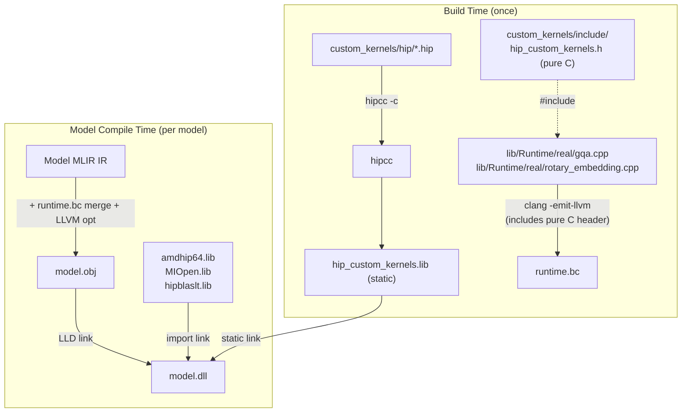

<!--
Copyright (C) 2026 Advanced Micro Devices, Inc. All rights reserved.
Licensed under the MIT License.
-->
# Custom HIP Kernel Infrastructure

## Architecture

The existing ops (Conv, Gemm, etc.) call ROCm library APIs (MIOpen, hipBLASLt) which ship as `.lib` + `.dll`. GQA and RoPE have no such library API, so we build custom HIP kernels as a **static library** that gets linked directly into `model.dll`.




Key insight: The `.hip` files contain `__global__` kernels compiled by hipcc into fat binaries (host + device code). When statically linked into `model.dll`, the HIP runtime extracts and launches the device code at inference time.

## Directory Structure

```
onnx-hipdnn-ep/
├── 3rd-party/custom_kernels/
│   ├── CMakeLists.txt                # Builds .hip files into static lib + install rules
│   ├── cmake/
│   │   └── hip_utils.cmake           # hipcc compilation infrastructure
│   ├── include/
│   │   ├── hip_custom_kernels.h     # Pure C header (no HIP types)
│   │   └── debug_log.h
│   └── hip/
│       ├── rope_kernel.hip           # RoPE __global__ kernel + host launcher
│       ├── gqa_kernel.hip            # GQA __global__ kernel + host launcher
│       └── ...                       # Additional op kernels
├── lib/Runtime/
│   ├── real/
│   │   ├── rotary_embedding.cpp      # wrap_rotary_embedding -> calls C launchers
│   │   └── gqa.cpp                   # wrap_group_query_attention -> calls C launchers
│   └── CMakeLists.txt                # MODIFIED: Add new bitcode modules
└── lib/Compiler/
    ├── CompilerDriver.cpp            # MODIFIED: Add hip_custom_kernels.lib to link line
    └── CMakeLists.txt                # MODIFIED: Configure HIP_CUSTOM_KERNELS_LIB_PATH
```

## File Details

### 1. `custom_kernels/cmake/hip_utils.cmake`

Adapted from onnx-hipdnn-ep. Provides `hip_add_library()` function that:

- On Windows: Uses `hipcc -c` to compile each `.hip` file to `.obj`, bundles into static lib
- On Linux: Uses CMake HIP language support
- Handles architecture flags (`--offload-arch=gfxNNNN`), MSVC ABI compatibility (`-fms-extensions`, `-fms-compatibility`), CRT flags (`/MT` static CRT), and Debug/Release configs
- Finds HIP via `HIP_PATH`, `ROCM_PATH`, or `THEROCK_DIST` environment/CMake variables

### 2. `custom_kernels/include/hip_custom_kernels.h`

Pure C header with `extern "C"` declarations -- no HIP types, only `void*`, `int64_t`, `float`, etc. This is what the runtime `.cpp` files include (compiled by Clang to bitcode). Example interface:

```c
#ifdef __cplusplus
extern "C" {
#endif

int hip_rope_forward(
    void* stream,           // hipStream_t cast to void*
    const void* input,      // GPU pointer
    const void* position_ids,
    const void* cos_cache,
    const void* sin_cache,
    void* output,
    int64_t batch_size, int64_t seq_len,
    int64_t num_heads, int64_t head_dim,
    int64_t rotary_dim,
    int64_t interleaved,
    int64_t element_size_bytes);

int hip_gqa_forward(
    void* stream,
    const void* query, const void* key, const void* value,
    const void* past_key, const void* past_value,
    const void* seqlens_k, const void* total_seq_len,
    void* output, void* present_key, void* present_value,
    int64_t batch_size, int64_t seq_len_q, int64_t seq_len_kv,
    int64_t num_heads, int64_t kv_num_heads, int64_t head_dim,
    float scale, float softcap,
    int64_t do_rotary, int64_t rotary_interleaved,
    const void* cos_cache, const void* sin_cache,
    int64_t element_size_bytes);

#ifdef __cplusplus
}
#endif
```

### 3. `custom_kernels/hip/rope_kernel.hip`

Implements the RoPE HIP kernel:

- `__global__ void rope_forward_kernel(...)` -- per-element rotary embedding: for each (batch, head, pos, dim_pair), applies cos/sin rotation
- `extern "C" int hip_rope_forward(...)` -- host launcher that calculates grid/block dims and calls `hipLaunchKernelGGL`

### 4. `custom_kernels/hip/gqa_kernel.hip`

Implements GQA as a multi-step operation:

- **KV cache update**: Concatenate current K/V with past K/V into present K/V
- **Optional RoPE**: If `do_rotary`, apply RoPE to Q and K (reuse rope logic)
- **Attention** (single-token decode): two co-resident kernel families dispatched by `lib/Runtime/real/gqa.cpp`:
  - `gqa_fused_decode` — original short-context kernel (one block per query head); preferred at small `skv` where reduction overhead would dominate.
  - `gqa_flash_decode<D, K_SPLITS>` + `gqa_flash_decode_reduce_kernel<D, K_SPLITS>` — GQA-aware split-K Flash Attention 2 for long contexts. One block per (batch, kv-head, K_SPLIT); each block stages K/V tiles into LDS once and reuses them across all HPG=4 query heads (eliminating the 4× KV bandwidth waste of per-query-head loops). Online softmax in log2e space writes `{m, l, O[D]}` partials to a workspace; the reduction kernel merges them across splits. Templated for `D ∈ {64, 128}`, `K_SPLITS=8`.
- **Prefill**: `gqa_fused_prefill` (multi-token) computes Q·K^T, softmax, and `attn·V` against the assembled KV cache.
- Can start with a straightforward implementation and optimize later (or swap in CK).

### 5. `custom_kernels/CMakeLists.txt`

Build the static library AND install both the `.lib` and `.h` to the install prefix. At model-compile time, CompilerDriver discovers the installed `.lib` from the install prefix.

```cmake
cmake_minimum_required(VERSION 3.18)

include(${CMAKE_CURRENT_SOURCE_DIR}/cmake/hip_utils.cmake)

# Default architecture if not set by parent
if(NOT HIP_ARCHITECTURES)
    set(HIP_ARCHITECTURES "gfx1103" CACHE STRING
        "Target GPU architectures for custom kernels")
endif()

# Build the static library from HIP sources
hip_add_library(hip_custom_kernels STATIC
    hip/rope_kernel.hip
    hip/gqa_kernel.hip
    INCLUDE_DIRECTORIES
        ${CMAKE_CURRENT_SOURCE_DIR}/include
)

# Export the library path for CompilerDriver to discover at model-compile time
set(HIP_CUSTOM_KERNELS_LIB_PATH "$<TARGET_FILE:hip_custom_kernels>" PARENT_SCOPE)

# Export include directory for Runtime bitcode compilation
set(HIP_CUSTOM_KERNELS_INCLUDE_DIR "${CMAKE_CURRENT_SOURCE_DIR}/include" PARENT_SCOPE)

# Install the static library and header to the install prefix
install(TARGETS hip_custom_kernels
    ARCHIVE DESTINATION lib
    LIBRARY DESTINATION lib
)
install(FILES include/hip_custom_kernels.h DESTINATION include)
```

After `cmake --install`, the install prefix will contain:

- `<prefix>/lib/hip_custom_kernels.lib` (or `.a` on Linux)
- `<prefix>/include/hip_custom_kernels.h`

The top-level `CMakeLists.txt` gates this on real runtime builds:

```cmake
# Custom HIP kernels (GQA, RoPE) — only when building real runtime with ROCm
if(NOT BUILD_MOCK_RUNTIME)
    add_subdirectory(custom_kernels)
endif()
```

### 6. `lib/Runtime/real/rotary_embedding.cpp` and `gqa.cpp`

These are compiled to bitcode (via `clang -emit-llvm`) and merged into `runtime.bc`. They:

- Include `hip_custom_kernels.h` (pure C, Clang-compatible)
- Implement `wrap_rotary_embedding(...)` and `wrap_group_query_attention(...)` (declared in [hipdnn_ep_runtime.h](lib/Runtime/hipdnn_ep_runtime.h))
- Extract the HIP stream from `RuntimeState*` via `hipdnn_ep_state_get_stream()`
- Compute shape info from the parameters passed by the compiler lowering
- Call the `hip_rope_forward()` / `hip_gqa_forward()` C functions

### 7. `lib/Runtime/CMakeLists.txt` changes

Add the new bitcode modules to the real runtime build (around line 210):

```cmake
compile_to_bitcode(real/rotary_embedding.cpp runtime_rotary_embedding.bc)
compile_to_bitcode(real/gqa.cpp runtime_gqa.bc)
```

Add them to `RUNTIME_BC_MODULES` list. Also add `-I${CMAKE_SOURCE_DIR}/custom_kernels/include` to the `compile_to_bitcode` macro's include flags so Clang can find `hip_custom_kernels.h`.

### 8. `lib/Compiler/CompilerDriver.cpp` changes

In `compileImpl()` (around line 180-204), add the custom kernel library to the link line. The library is discovered from the **install prefix** (same `CMAKE_PREFIX_PATH` used during build, configured via CMake at compile time):

```cpp
// Custom kernel library path - configured at CMake time from CMAKE_INSTALL_PREFIX
// Defined via: target_compile_definitions(... HIP_CUSTOM_KERNELS_LIB_PATH="...")
std::string custom_kernels_lib = HIP_CUSTOM_KERNELS_LIB_PATH;
if (llvm::sys::fs::exists(custom_kernels_lib)) {
    libraries.push_back(custom_kernels_lib);
    std::cout << "  Linking custom kernels: " << custom_kernels_lib << "\n";
}
```

The path is baked in at CMake configure time via a `#define`, pointing to `<install_prefix>/lib/hip_custom_kernels.lib`. This follows the same pattern as the install prefix (`../../local`) used by the project.

### 9. Install rules summary

The `custom_kernels/CMakeLists.txt` install rules ensure that after `cmake --install`:

- `<prefix>/lib/hip_custom_kernels.lib` -- static library with compiled HIP kernels (fat binaries)
- `<prefix>/include/hip_custom_kernels.h` -- pure C header for the kernel API

CompilerDriver discovers the `.lib` at model-compile time via the configured install prefix path, and passes it to DLLLinker alongside MIOpen/hipBLASLt import libs.

## Key Design Decisions

- **Static lib, not DLL**: The kernel code is embedded in `model.dll` via static linking. No extra DLL dependency beyond amdhip64.dll.
- **Pure C header interface**: The header uses only C types (`void`*, `int64_t`, `float`) so it can be included by Clang during bitcode compilation AND by MSVC if needed.
- **Separation of concerns**: `.hip` files contain device code (compiled by hipcc); `.cpp` runtime wrappers contain host logic (compiled by Clang to bitcode). They communicate through the C header.
- `**hip_utils.cmake` reuse**: Proven approach from onnx-hipdnn-ep, handles Windows hipcc compilation, multi-config generators, architecture flags.
